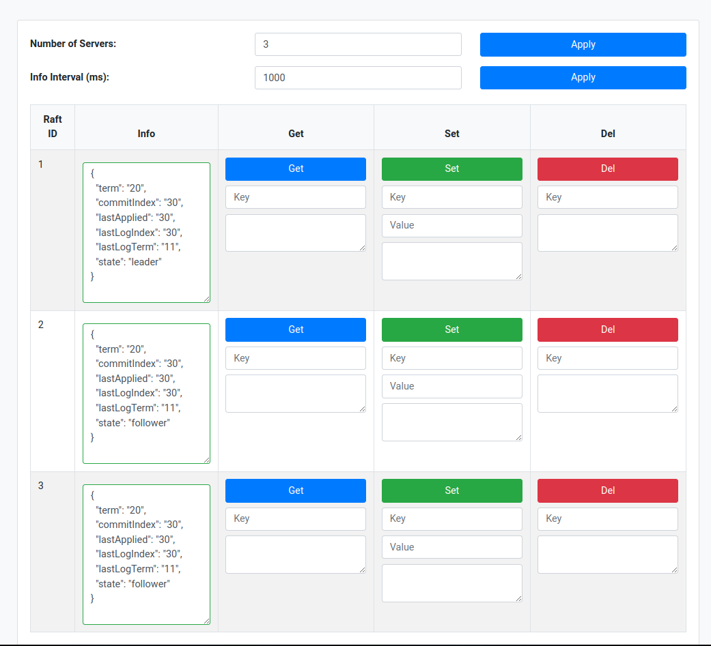

# raft-kv 🗃️

A **raft** based **key-value** store.



## Motivation 💫

- Learn Raft in depth

## Demo ❤️‍🔥

**[YOUTUBE](https://youtu.be/01LryhHyKDk)**

## Prerequisites 📚

- [task](https://taskfile.dev/#/installation)
- [docker-compose](https://docs.docker.com/compose/install/)

## Run 🚀

Start the raft cluster

```bash
task docker-up
```

Start the UI

```bash
task ui
```

### Endpoint 🧭

| App       | Endpoint                |
|-----------|-------------------------|
| UI        | <http://localhost:3000> |
| Dozzle    | <http://localhost:8080> |
| Portainer | <http://localhost:9000> |

## API 📖

- [raft](./api/raft/raft.proto)
- [kv](./api/kv/kv.proto)

## Config ⚙️

**[2X]** = Value used in the code is randomly selected within the interval [VALUE, 2 * VALUE).

| Config                      | Description                                                                                                              | Default     |
|-----------------------------|--------------------------------------------------------------------------------------------------------------------------|-------------|
| LOG_LEVEL                   | The log level for the zap logger                                                                                         | INFO        |
| RAFT_ID                     | Unique node identifier within the cluster                                                                                | NULL        |
| RAFT_CLUSTER                | Comma-separated list of servers in the format `[RAFT_ID@HOST:PORT]`                                                      | NULL        |
| RAFT_REQUEST_VOTE_TIMEOUT   | Timeout (in ms) for the gRPC RequestVote method                                                                          | 150         |
| RAFT_APPEND_ENTRIES_TIMEOUT | Timeout (in ms) for the gRPC AppendEntries method                                                                        | 150         |
| RAFT_COMMIT_PERIOD          | Interval (in ms) at which committed messages are applied to the state machine **[2X]**                                   | 50          |
| RAFT_START_DELAY            | Initial delay (in ms) before starting the Raft protocol, allowing time for cluster nodes to initialize **[2X]**          | 1500        |
| RAFT_ELECTION_TIMEOUT       | Duration (in ms) to wait for a leader's heartbeat before transitioning to candidate state **[2X]**                       | 300         |
| RAFT_STALE_PERIOD           | Maximum duration (in ms) between the leader's contact with a follower before declaring the follower unreachable **[2X]** | 200         |
| RAFT_HEARTBEAT_PERIOD       | Frequency (in ms) of heartbeat messages sent to followers **[2X]**                                                       | 50          |
| RAFT_HEARTBEAT_BATCH_SIZE   | Maximum number of log entries to include in a single heartbeat message                                                   | 10000       |
| BADGER_ENTRY_PATH           | Filesystem path for storing the Raft log entries                                                                         | /data/entry |
| BADGER_STATE_PATH           | Filesystem path for storing the Raft protocol state                                                                      | /data/state |
| BADGER_KV_PATH              | Filesystem path for storing the key-value state machine data                                                             | /data/kv    |  

---


